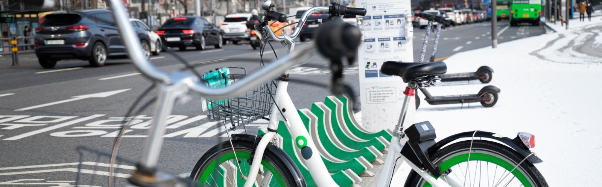
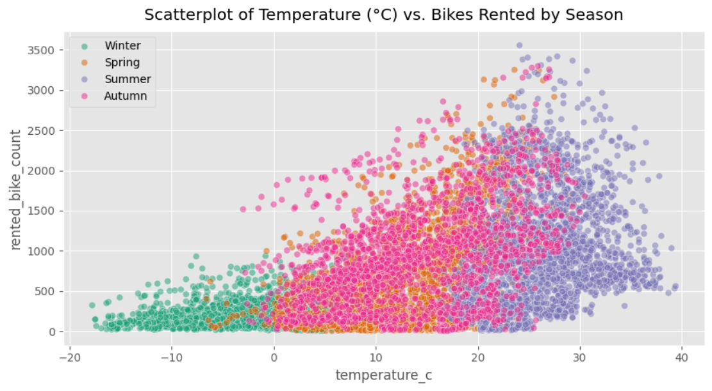
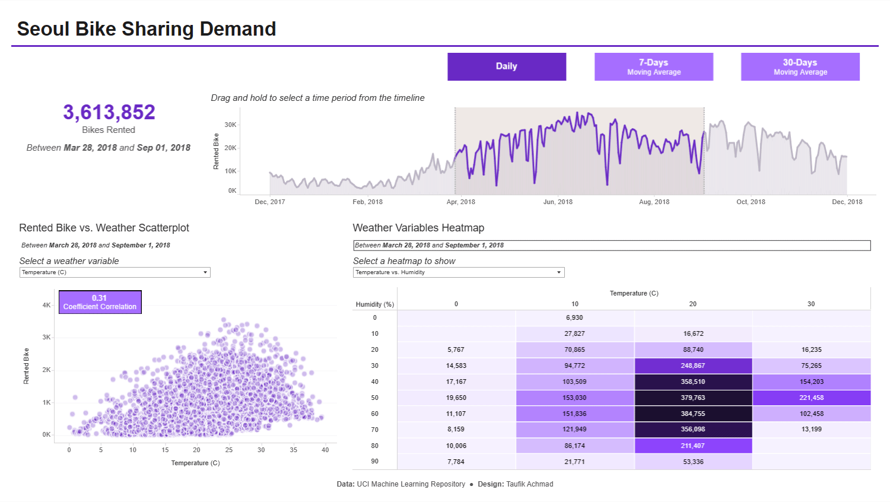

# Seoul Bike Sharing Demand

## 🚨 Situation

The bike-sharing startup is experiencing fluctuations in demand, with some days having too few available bikes and others having too many. The founder is interested in predicting bike rentals based on weather, time of year, and time of day.

## 📜 Task

My task is to perform a comprehensive time series analysis using Python on the historical bike rental data to identify patterns, trends, and seasonality that can guide decisions on bike availability.

## 👨‍💻 Action

1. **Data Collection**: I began by gathering the data ([source](https://archive.ics.uci.edu/dataset/560/seoul+bike+sharing+demand)) from UCI Machine Learning Repository site.

2. [**Time Series Analysis**](./analysis.ipynb): I performed an exploratory data analysis to visualize and identify temporal patterns, and applied statistical methods to find trends and seasonality. This analysis served as the foundation for deriving insights and recommendations to optimize bike availability.

*Image from the project*

3. [**Bike Sharing Demand Dashboard**](https://public.tableau.com/views/SeoulBIkeShare/Dashboard2?:language=en-US&publish=yes&:display_count=n&:origin=viz_share_link): I also designed an interactive Tableau Dashboard to observe how the bikes rented change over time and how the weather affects them.

*Tableau dashboard*

## 🚀 Result

The time series analysis revealed some patterns in bike rentals over time. For example, by understanding that temperature correlates the most with the bike rented throughout the time, determining when the possibility of a high number of rents occurred could be done. These insights provide a foundation for more effective bike availability planning.
