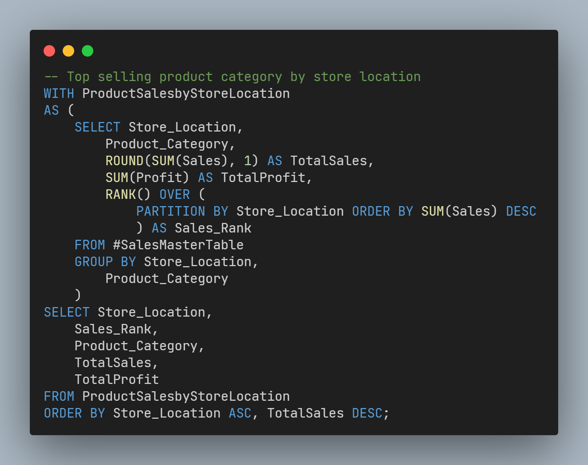
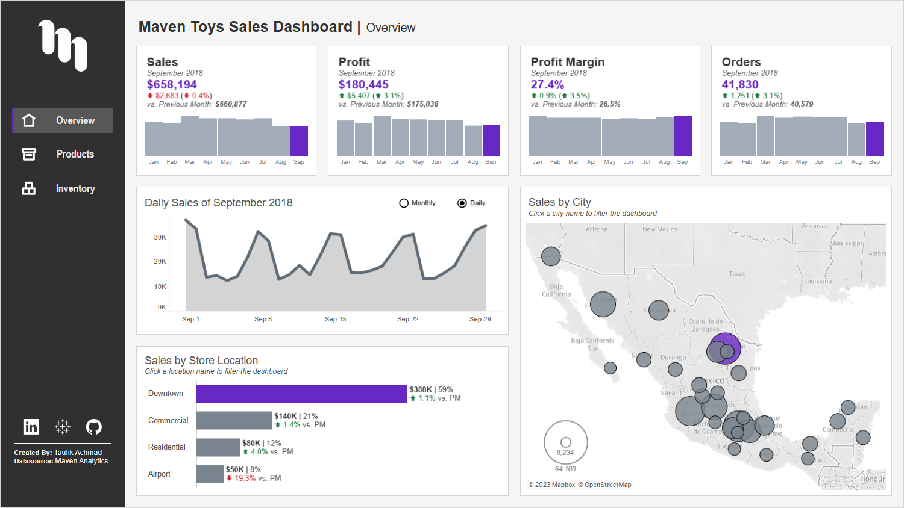

# Maven Toys Sales Analysis

## Quick Links

### [Tableau Dashboard](https://public.tableau.com/views/MavenToysSalesDashboard_16958918265180/Overview?:language=en-US&:display_count=n&:origin=viz_share_link) | [Dataset](https://mavenanalytics.io/data-playground)

# Business Problem

Maven Toys is a fictitious toy store in Mexico that has 50 stores and sells more than 30 kinds of products. They are aiming to improve their business operations and maximize the profitability of their products.

# Business Task

Maven Toys have compiled their sales and inventory record data but it was too difficult to understand their products’ overall sales performance and how well they handle stockings for their products.

The goal of this project was to perform analysis on the sales and inventory data the business has using SQL and create an executive dashboard using Tableau to help the business gain the information they needs at their fingertips.

# Approach

With the dataset in hand, I fed the data into SQL Server to process and perform analysis on the business's sales performance and to understand their current inventory levels by joining relevant data, using CTEs, and CASE statements.

*Full code [here](./sql/analysis.sql)*

*Code from project*

I then used Tableau to create an interactive dashboard that will help the business gain insight into their sales performance, product performance, and current inventory by showing metrics using KPIs, data drill-down, and advanced tables with relevant information based on the data provided.

# Result

With the dashboard, the business could gain insights easily through relevant metrics and data to improve their business operations and maximize the profitability of their products.
